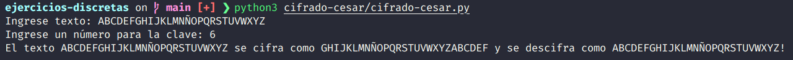

# Cifrado César

"En criptografía, el cifrado César, también conocido como cifrado por desplazamiento, código de César o desplazamiento de César, es una de las técnicas de cifrado más simples y más usadas. Es un tipo de **cifrado por sustitución** en el que una letra en el texto original es reemplazada por otra letra que se encuentra un número fijo de posiciones más adelante en el alfabeto. Este método debe su nombre a Julio César, que lo usaba para comunicarse con sus generales."

### Referencias bibliográficas

- Bauer, F. (2000). Decrypted Secrets: methods and maxims of cryptology (2da ed.). Springer.

- Kahn, D. (1996). Codebreakers — The Story of Secret Writing (2da ed.). Scribner.

- Singh, S. (2000). The code book: the science of secrecy from ancient Egypt to quantum cryptography. Anchor Books.

# Funcionamiento

# Captura de pantalla

