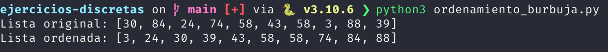

# Ordenamiento de burbuja

"El ordenamiento de burbuja es un sencillo algoritmo de ordenamiento. Funciona revisando cada elemento de la lista que va a ser ordenada con el siguiente, intercambiándolos de posición si están en el orden equivocado. Es necesario revisar varias veces toda la lista hasta que no se necesiten más intercambios, lo cual significa que la lista está ordenada. También es conocido como el **método del intercambio directo**."

### Referencias bibliográficas

- Astrachan, O. (2003). Bubble sort. ACM SIGCSE Bulletin, 35, 1-5. https://doi.org/10.1145/792548.611918

- Knuth, D. (1998). The art of computer programming (2da ed., pág. 106-110). Addison-Wesley.

# Funcionamiento

# Captura de pantalla

